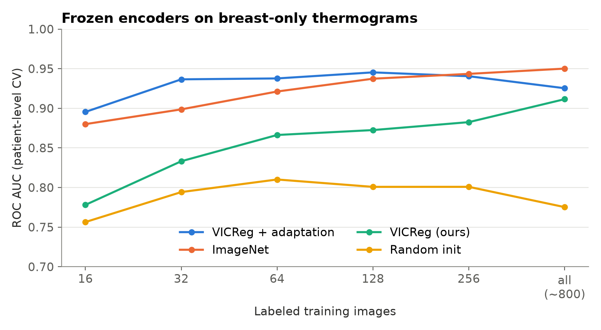

# Breast Cancer Detection from Thermal Images

Segmentation-guided self-supervised learning for label-efficient breast cancer detection on infrared thermograms.

[](https://github.com/gpassoni/breast_cancer_detection/actions/workflows/ci.yml)
[](https://www.python.org/)
[](https://pytorch.org/)
[](LICENSE)


## Highlights

- **End-to-end pipeline**: R2AttU-Net breast segmentation, VICReg self-supervised ResNet-50,
  in-domain self-supervised adaptation and a few-label classifier.
- **0.94 ROC AUC with only 32 labeled images** on the public DMR-IR dataset, under strict
  patient-level cross-validation (no patient in both training and test data).
- **Matches or beats ImageNet features up to 256 labels**; segmentation-guided input lifts the
  self-supervised features from 0.72 to 0.87 AUC at 64 labels.
- **Segmentation transfers zero-shot** to a new camera and hospital (Dice 0.74 on 1,000 DMR-IR
  images) and reaches Dice 0.84 on an external clinical test set.
- **Engineered for trust**: bit-exact preprocessing checks, metrics validated against
  scikit-learn, 27 unit tests and CI.

## What it is

An end-to-end pipeline that turns a raw thermogram into a cancer / no-cancer score:

1. an **R2AttU-Net** segments the two breasts;
2. a **ResNet-50 pretrained with VICReg** on unlabeled clinical thermograms, and further adapted
   with the same self-supervised objective to the target images, embeds the breast-only image;
3. a lightweight classifier trained on a handful of labels predicts the diagnosis.

## Why it matters

Thermography is non-invasive, radiation-free and inexpensive, which makes it attractive for
screening where mammography is not available. The bottleneck is labeled data: diagnosed
thermograms are scarce, while unlabeled ones are comparatively easy to collect. This project
turns unlabeled images into label efficiency, and shows that *what the encoder looks at* matters
as much as how it was pretrained.

## Results

**Classification on DMR-IR** (1,000 frames from 44 patients; 5-fold patient-level CV, 5 random
label subsets per fold; logistic-regression head on frozen features; ROC AUC, mean across folds)

| Encoder (breast-only input) | 16 labels | 32 | 64 | 128 | All (~800) |
|---|---:|---:|---:|---:|---:|
| **VICReg + in-domain adaptation (ours)** | **0.895** | **0.937** | **0.938** | **0.945** | 0.925 |
| VICReg, clinical pretraining (ours) | 0.778 | 0.833 | 0.866 | 0.873 | 0.912 |
| ImageNet ResNet-50 | 0.880 | 0.899 | 0.921 | 0.937 | **0.950** |
| Random initialisation | 0.756 | 0.794 | 0.810 | 0.801 | 0.775 |

Fold-to-fold standard deviation is 0.06-0.10 AUC (about 9 test patients per fold).



- **Self-supervised adaptation gives the best label efficiency**: 0.94 AUC with 32 labels, a
  level ImageNet features reach only with 128-256 labels.
- **Segmentation-guided input is essential**: the same VICReg backbone scores 0.721 AUC at 64
  labels on full frames and 0.866 on breast-only input (0.886 vs 0.912 with all labels).
- **Patient-level diagnosis** (all labels, frame probabilities averaged per patient, 44
  patients): AUC 0.936 with the clinical VICReg backbone, 0.915 after adaptation, 0.954 with
  ImageNet.

**Breast segmentation**

| Model | Evaluation | Dice | IoU | Precision | Recall |
|---|---|---:|---:|---:|---:|
| Binary variant (39.5M params) | Held-out clinical images, 5 runs | 0.783 ± 0.060 | 0.673 ± 0.092 | 0.874 | 0.772 |
| Released 3-class model (2.5M params) | External clinical test set, 21 images | 0.838 | 0.721 | 0.820 | 0.857 |
| Released 3-class model (2.5M params) | DMR-IR zero-shot, 1,000 images | 0.738 | 0.589 | 0.870 | 0.646 |

DMR-IR comes from a camera, site and population never used for training: 87% of the predicted
area lies inside the annotated breast region, while recall is capped because DMR-IR annotations
also include the area between the breasts, which the model does not segment by design.

Tables and plots: [`notebooks/`](notebooks/). Per-run results: [`results/`](results/).

## How it works

- **Segmentation**: recurrent residual U-Net with attention gates
  ([R2AttU-Net](https://github.com/LeeJunHyun/Image_Segmentation)) with configurable depth and
  width, predicting background / left / right breast. Focal Tversky or cross-entropy loss, mixed
  precision, gradient accumulation and Bayesian hyperparameter search with Weights & Biases
  ([`configs/`](configs/)).
- **Self-supervised pretraining**: [VICReg](https://github.com/facebookresearch/vicreg)
  ResNet-50 trained on unlabeled clinical thermograms on a SLURM GPU cluster
  ([`scripts/ssl/run_vicreg_slurm.sh`](scripts/ssl/run_vicreg_slurm.sh); training curves in
  [`results/vicreg/`](results/vicreg/)).
- **In-domain adaptation**: the pretrained backbone is trained further with the same
  self-supervised objective on unlabeled, breast-only target images, using only each fold's
  training patients (about 12 minutes per fold on a single RTX 3060 Ti). Augmentations are
  strong geometrically but mild in intensity, since temperature patterns carry the diagnostic
  signal ([`scripts/ssl/vicreg_adapt.py`](scripts/ssl/vicreg_adapt.py)).
- **Classification**: pooled `layer3` + `layer4` features of the frozen encoder and a
  logistic-regression or MLP head trained with fixed hyperparameters and no validation labels,
  so a budget of *n* images means exactly *n* labels.
- **Evaluation protocol**: stratified 5-fold cross-validation grouped by patient, patient IDs
  parsed from all DMR-IR naming formats, identical folds for adaptation and classification, and
  ImageNet and random-initialisation baselines
  ([`src/thermal_bc/evaluation.py`](src/thermal_bc/evaluation.py)).
- **Verification**: [`scripts/check_pipeline.py`](scripts/check_pipeline.py) runs 24 checks in
  about a minute: data formats, bit-exact preprocessing parity with training, strict weight
  loading, activation health and metric implementations against scikit-learn.

**Stack**: PyTorch, torchvision, torchmetrics, scikit-learn, Albumentations, OpenCV, pandas,
Weights & Biases, SLURM + Singularity, pytest, ruff, GitHub Actions.

## How to run

```bash
git clone https://github.com/gpassoni/breast_cancer_detection.git
cd breast_cancer_detection
python -m venv .venv && source .venv/bin/activate      # Windows: .venv\Scripts\activate
pip install torch torchvision --index-url https://download.pytorch.org/whl/cu126
pip install -e ".[notebooks,dev]"
git clone https://github.com/facebookresearch/vicreg.git vicreg   # provides resnet.py
pytest                                                            # unit tests, no data needed
```

The notebooks only read `results/`, so they run without data or weights:

```bash
jupyter lab notebooks/
```

Reproducing the experiments requires DMR-IR (see [`data/README.md`](data/README.md)) and the
trained weights in `weights/`. The segmentation and self-supervised models were trained on
private clinical images that cannot be shared, so their weights are not distributed.

```bash
python scripts/check_pipeline.py                        # end-to-end sanity check (~1 min)
python scripts/segmentation/evaluate_dmrir.py           # zero-shot segmentation on DMR-IR
python scripts/ssl/vicreg_adapt.py --init weights/vicreg_resnet50.pth --out-dir weights/vicreg_adapted
python scripts/classification/benchmark.py --input masked --layers layer3+4 --head logreg \
    --output results/classification_benchmark.csv \
    --encoder "VICReg (ours)=weights/vicreg_resnet50.pth" \
    --encoder "VICReg + adaptation=weights/vicreg_adapted/fold{fold}.pth" \
    --encoder "ImageNet=imagenet" --encoder "Random init=random"
```

## Project structure

```
├── src/thermal_bc/
│   ├── pipeline.py          # raw thermogram -> breast mask -> breast-only embedding
│   ├── features.py          # segmentation-guided inputs, pooled ResNet features, caching
│   ├── evaluation.py        # patient-level CV protocol, classification heads, metrics
│   ├── data/                # datasets, augmentations, DMR-IR patient IDs, FLIR I/O
│   └── models/              # R2AttU-Net, loss, metrics, trainer, VICReg
├── scripts/
│   ├── segmentation/        # data preparation, training, sweep, evaluation
│   ├── ssl/                 # VICReg pretraining (SLURM) and in-domain adaptation
│   ├── classification/      # label-efficiency benchmark
│   └── check_pipeline.py    # end-to-end sanity check
├── tests/                   # unit tests (CPU, no data needed)
├── notebooks/               # 01 segmentation, 02 self-supervised classification
├── results/                 # per-run CSVs and VICReg training logs
├── configs/                 # segmentation hyperparameters, W&B sweep
└── data/README.md           # how to obtain and lay out the data
```

## What I learned and next steps

- **The input matters as much as the pretraining.** Restricting the encoder to breast tissue,
  using the project's own segmentation model, was a large improvement for the self-supervised
  features.
- **Diagnosing representations pays off.** The clinically pretrained embeddings are partially
  collapsed (effective rank of about 5 out of 2,048 dimensions, reported by
  `scripts/check_pipeline.py`); a short in-domain self-supervised adaptation made the backbone
  the most label-efficient encoder.
- **Evaluation design drives the conclusions.** Patient-grouped splits, per-patient scoring and
  ImageNet and random baselines are what make the numbers trustworthy.
- **Next**: compare adaptation started from ImageNet and random weights, fine-tune the adapted
  backbone end to end, and validate on an independent thermography cohort.

## License

[MIT](LICENSE)
