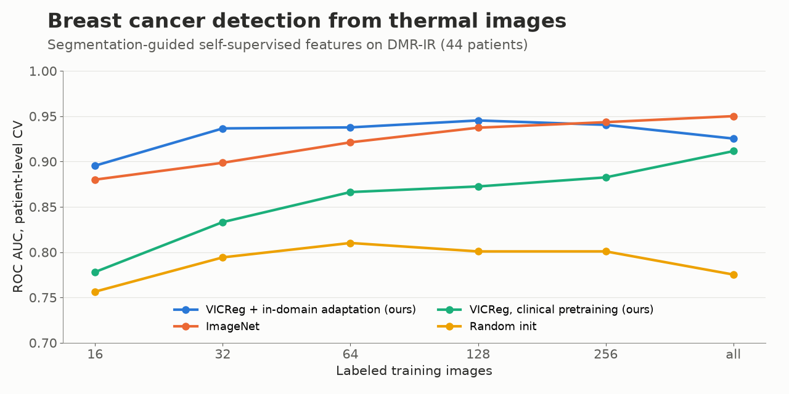
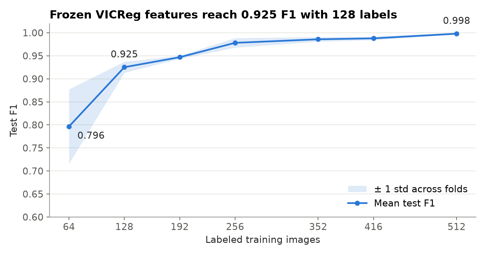

# Breast Cancer Detection from Thermal Images

Self-supervised learning and attention U-Net segmentation for label-efficient breast cancer screening on infrared thermograms.

[](https://www.python.org/)
[](https://pytorch.org/)
[](LICENSE)



## What it is

A two-stage deep learning pipeline for detecting breast cancer in thermal (infrared) images.
An **R2AttU-Net** first segments the breasts from the rest of the thermogram. A **ResNet-50
pretrained with VICReg** on unlabeled thermal images then provides features for a lightweight
classifier that separates healthy from cancerous cases, trained with only a few hundred labels.

## Why it matters

Thermography is non-invasive, radiation-free and cheap compared with mammography, which makes it
attractive for screening where mammography is not accessible. The bottleneck is data: annotated
thermal datasets are small and expensive to label. This project tackles that directly:

- **Self-supervised pretraining** learns representations from unlabeled images, so the classifier
  needs far fewer labels.
- **Segmentation robustness** is measured on an external test set from a different acquisition
  setup, and an augmentation ablation identifies what actually makes the model generalise.

## Results

**Classification on DMR-IR** (public dataset): frozen VICReg backbone + MLP head, test set
metrics, mean ± std over 5 folds for each number of labeled training images.

| Labeled images | F1 | Precision | Recall | AUC |
|---:|---:|---:|---:|---:|
| 64 | 0.796 ± 0.081 | 0.849 | 0.792 | 0.777 |
| 128 | **0.925 ± 0.012** | 0.982 | 0.875 | 0.929 |
| 256 | 0.978 ± 0.010 | 1.000 | 0.957 | 0.979 |
| 512 | 0.998 ± 0.002 | 1.000 | 0.996 | 0.998 |



**Breast segmentation** (private clinical FLIR images, 244 annotated training images):

| Evaluation | Dice | IoU | Sensitivity | Specificity |
|---|---:|---:|---:|---:|
| Held-out split, 5 training runs (mean ± std) | 0.783 ± 0.060 | 0.673 ± 0.092 | 0.772 | 0.971 |
| Best model on external FLIR test set (21 images) | 0.838 | 0.721 | 0.857 | 0.973 |

**Augmentation ablation** (test F1 on the external set, 5 runs each): no augmentation 0.461,
photometric only 0.414, **geometric/structural 0.726**, geometric + photometric 0.702.
Geometric augmentation is what lets the model transfer to new acquisition conditions.

Full tables and plots are in [`notebooks/`](notebooks/); raw per-run results are in [`results/`](results/).

## How it works

1. **Preprocessing.** Thermal images are resized and min-max normalised; left and right breast
   masks are merged into a single label map. Utilities are included to extract temperature maps
   from radiometric FLIR JPEGs ([`flyr`](https://pypi.org/project/flyr/)) and for classical
   enhancement (percentile clipping, wavelet denoising, CLAHE, DoG sharpening).
2. **Segmentation.** A recurrent residual U-Net with attention gates
   ([R2AttU-Net](https://github.com/LeeJunHyun/Image_Segmentation)), generalised to configurable
   depth and width. Trained with focal Tversky or cross-entropy loss, mixed precision and
   gradient accumulation; hyperparameters found with a Bayesian W&B sweep
   ([`configs/`](configs/)).
3. **Self-supervised pretraining.** [VICReg](https://github.com/facebookresearch/vicreg) trains a
   ResNet-50 on unlabeled thermal images on a SLURM GPU cluster
   ([`scripts/run_vicreg_slurm.sh`](scripts/run_vicreg_slurm.sh); training logs in
   [`results/vicreg/`](results/vicreg/)).
4. **Classification.** The pretrained backbone is frozen and a 2-layer MLP head is trained on
   DMR-IR with binary cross-entropy and early stopping.

**Stack:** PyTorch, torchmetrics, Albumentations, OpenCV, scikit-image, scikit-learn,
Weights & Biases, SLURM + Singularity.

## Reproducibility

The code is complete, but the results cannot be fully reproduced from this repository alone:

- The segmentation and self-supervised pretraining images are **private clinical data** collected
  under a data agreement and cannot be redistributed. Patient images are therefore not shown
  anywhere in the repository.
- Trained weights (segmentation model and VICReg backbone) are not distributed, since they were
  trained on that private data.
- VICReg pretraining was run on a GPU cluster because of its compute requirements.

The DMR-IR classification experiments use a public dataset; with a VICReg backbone trained on
your own unlabeled thermal images, they run end to end. See [`data/README.md`](data/README.md).

## How to run

```bash
git clone https://github.com/gpassoni/breast_cancer_detection.git
cd breast_cancer_detection
python -m venv .venv && source .venv/bin/activate   # Windows: .venv\Scripts\activate
pip install -e ".[notebooks]"
cp .env.example .env        # set ROOT_DIR and your W&B key
```

Place the data as described in [`data/README.md`](data/README.md), then:

```bash
# Segmentation
python scripts/prepare_masks.py
python scripts/prepare_flir_test_set.py
python scripts/train_segmentation.py
python scripts/augmentation_ablation.py
python scripts/segmentation_repeated_runs.py
wandb sweep configs/sweep_binary.yaml          # hyperparameter search, then `wandb agent <id>`

# Self-supervised pretraining (clone facebookresearch/vicreg into ./vicreg first)
sbatch scripts/run_vicreg_slurm.sh

# DMR-IR classification
python scripts/classification_data_efficiency.py --backbone vicreg/checkpoints/resnet50.pth
python scripts/classification_finetune.py --backbone vicreg/checkpoints/resnet50.pth
```

The result notebooks read from `results/` and run without any data:

```bash
jupyter lab notebooks/
```

## Project structure

```
├── src/thermal_bc/
│   ├── data/            # datasets, augmentations, preprocessing
│   ├── models/          # R2AttU-Net, losses, metrics, trainer, classification head
│   ├── config.py
│   └── utils.py
├── scripts/             # data preparation, training and evaluation entry points
├── configs/             # best segmentation hyperparameters, W&B sweep
├── notebooks/           # 01 segmentation, 02 augmentation ablation, 03 classification
├── results/             # per-run CSVs and VICReg training logs
├── figures/             # plots generated by the notebooks
└── data/README.md       # how to obtain and lay out the data
```

## What I learned and next steps

- In-distribution validation scores can badly overestimate performance on a new acquisition
  setup; an external test set and a targeted ablation were needed to see it.
- Self-supervised features make a small labeled set go a long way: 128 labels already give
  0.925 F1 with a frozen backbone.
- Next: fine-tune the backbone end to end, feed the segmentation masks into the classifier, and
  validate on additional independent thermography datasets.

## License

[MIT](LICENSE)
